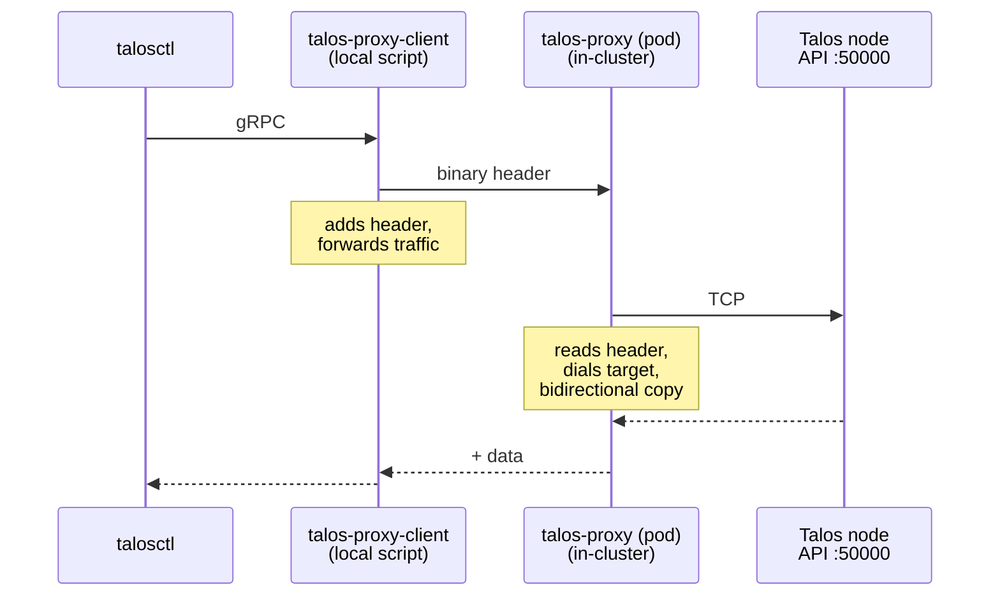

# talos-proxy

A lightweight TCP proxy for [Talos Linux](https://www.talos.dev/) clusters. It accepts incoming connections, reads a target address from a binary header, and performs bidirectional byte forwarding to the target. Designed to proxy Talos API traffic into the cluster.

## Protocol

Each client connection begins with a simple binary header:

| Field          | Size    | Encoding          | Description                         |
| -------------- | ------- | ----------------- | ----------------------------------- |
| Address length | 4 bytes | Big-endian uint32 | Length of the target address string |
| Address        | N bytes | UTF-8 string      | Target in `host:port` format        |

After the header is read, the proxy dials the target and copies bytes in both directions. Half-close is propagated so that either side can signal end-of-stream independently.

## Usage

```sh
talos-proxy [flags]
```

| Flag             | Default   | Description                                                      |
| ---------------- | --------- | ---------------------------------------------------------------- |
| `-listen-port`   | `50000`   | Port to listen on                                                |
| `-dial-timeout`  | `5s`      | Timeout for dialing target addresses                             |
| `-allowed-cidrs` | _(empty)_ | Comma-separated list of allowed target CIDRs (empty = allow all) |
| `-allowed-ports` | _(empty)_ | Comma-separated list of allowed target ports (empty = allow all) |
| `-log-level`     | `info`    | Log level (`debug`, `info`, `warn`, `error`)                     |

### Examples

```sh
# Listen on the default port, allow all targets
talos-proxy

# Restrict targets to a specific subnet
talos-proxy -allowed-cidrs 10.200.0.0/16

# Multiple allowed CIDRs
talos-proxy -allowed-cidrs "10.200.0.0/16,172.20.0.0/16"

# Restrict to specific ports
talos-proxy -allowed-ports "50000,443"

# Combine CIDR and port restrictions
talos-proxy -allowed-cidrs 10.200.0.0/16 -allowed-ports 50000
```

## Building

Requires Go 1.24+.

```sh
make build       # binary output to bin/talos-proxy
make test        # run tests with race detector
make lint        # run golangci-lint
```

## Container Image

A minimal `scratch`-based container image is published to `ghcr.io/kommodity-io/talos-proxy`.

Build locally:

```sh
make build-image VERSION=dev
```

## Helm Chart

A Helm chart is included under `charts/talos-proxy/` for deploying into Kubernetes clusters.

```sh
helm install talos-proxy charts/talos-proxy
```

Key values:

| Value              | Default                            | Description                          |
| ------------------ | ---------------------------------- | ------------------------------------ |
| `listenPort`       | `50000`                            | Proxy listen port                    |
| `dialTimeout`      | `5s`                               | Upstream dial timeout                |
| `allowedCIDRs`     | `""`                               | Comma-separated allowed target CIDRs |
| `allowedPorts`     | `"50000"`                          | Comma-separated allowed target ports |
| `logLevel`         | `"info"`                           | Log level                            |
| `image.repository` | `ghcr.io/kommodity-io/talos-proxy` | Container image repository           |
| `image.tag`        | Chart `appVersion`                 | Container image tag                  |

## Testing with talosctl

Since `talosctl` uses mTLS and verifies the server certificate against the endpoint address, you need to bind a loopback alias matching the target node IP. A helper script (`scripts/talos-proxy-client.py`) injects the binary header so that `talosctl` can communicate through the proxy.



```sh
# 1. Add a loopback alias so the target IP is reachable locally
sudo ifconfig lo0 alias <node_IP>

# 2. Port-forward the proxy from the cluster
kubectl port-forward deploy/talos-proxy 50000

# 3. Start the client proxy listening on the target IP
python3 scripts/talos-proxy-client.py --listen <node_IP>:50001 --target <node_IP>:50000

# 4. Use talosctl
talosctl --talosconfig <path_to_talosconfig> --endpoints <node_IP>:50001 --nodes <node_IP> version

# 5. Clean up when done
sudo ifconfig lo0 -alias <node_IP>
```
