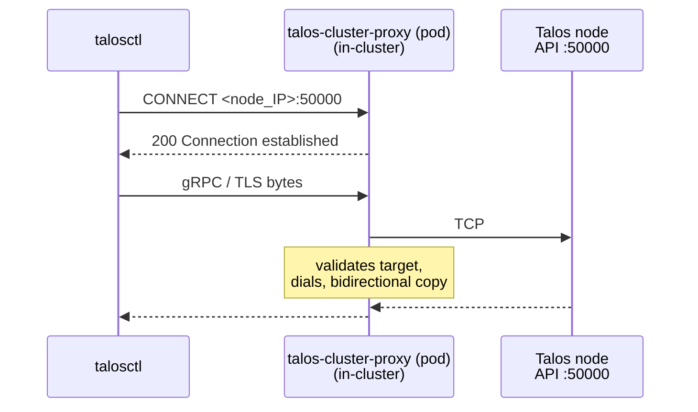

# talos-cluster-proxy

A lightweight HTTP CONNECT proxy for [Talos Linux](https://www.talos.dev/) clusters. It accepts `CONNECT` requests, dials the target, and performs bidirectional byte forwarding. Designed to proxy Talos API traffic into the cluster.

## Protocol

The proxy speaks standard HTTP CONNECT (RFC 9110 §9.3.6):

```text
→ CONNECT 10.200.0.5:50000 HTTP/1.1\r\nHost: 10.200.0.5:50000\r\n\r\n
← HTTP/1.1 200 Connection established\r\n\r\n
← [raw bytes forwarded in both directions]
```

Because this is the standard proxy protocol, it works out-of-the-box with `curl --proxy`, `HTTPS_PROXY`, gRPC's `GRPC_PROXY`, `talosctl`'s `DynamicProxyDialer`, and any HTTP client library.

Error responses:

| Status               | Meaning                                             |
| -------------------- | --------------------------------------------------- |
| `400 Bad Request`    | Non-CONNECT method or malformed request             |
| `403 Forbidden`      | Target denied by CIDR or port allowlist             |
| `502 Bad Gateway`    | Target could not be reached                         |

Half-close is propagated so either side can signal end-of-stream independently.

## Usage

```sh
talos-cluster-proxy [flags]
```

| Flag             | Default   | Description                                                      |
| ---------------- | --------- | ---------------------------------------------------------------- |
| `-listen-port`   | `50000`   | Port to listen on                                                |
| `-dial-timeout`  | `5s`      | Timeout for dialing target addresses                             |
| `-allowed-cidrs` | _(empty)_ | Comma-separated list of allowed target CIDRs (empty = allow all) |
| `-allowed-ports` | _(empty)_ | Comma-separated list of allowed target ports (empty = allow all) |
| `-log-level`     | `info`    | Log level (`debug`, `info`, `warn`, `error`)                     |

### Examples

```sh
# Listen on the default port, allow all targets
talos-cluster-proxy

# Restrict targets to a specific subnet
talos-cluster-proxy -allowed-cidrs 10.200.0.0/16

# Multiple allowed CIDRs
talos-cluster-proxy -allowed-cidrs "10.200.0.0/16,172.20.0.0/16"

# Restrict to specific ports
talos-cluster-proxy -allowed-ports "50000,443"

# Combine CIDR and port restrictions
talos-cluster-proxy -allowed-cidrs 10.200.0.0/16 -allowed-ports 50000
```

## Building

Make sure to have a recent version of Go installed. We recommend using gvm to install Go.

```bash
gvm install go1.26.1 -B
gvm use go1.26.1 --default
```

```sh
make build       # binary output to bin/talos-cluster-proxy
make test        # run tests with race detector
make lint        # run golangci-lint
```

## Container Image

A minimal `scratch`-based container image is published to `ghcr.io/kommodity-io/talos-cluster-proxy`.

Build locally:

```sh
make build-image
```

## Helm Chart

A Helm chart is included under `charts/talos-cluster-proxy/` for deploying into Kubernetes clusters.

```sh
helm install talos-cluster-proxy charts/talos-cluster-proxy
```

Key values:

| Value              | Default                                    | Description                                              |
| ------------------ | ------------------------------------------ | -------------------------------------------------------- |
| `listenPort`       | `50000`                                    | Proxy listen port                                        |
| `dialTimeout`      | `5s`                                       | Upstream dial timeout                                    |
| `allowedCIDRs`     | `""`                                       | Comma-separated allowed target CIDRs (empty = allow all) |
| `allowedPorts`     | `""`                                       | Comma-separated allowed target ports (empty = allow all) |
| `logLevel`         | `"info"`                                   | Log level                                                |
| `image.repository` | `ghcr.io/kommodity-io/talos-cluster-proxy` | Container image repository                               |
| `image.tag`        | Chart `appVersion`                         | Container image tag                                      |

## Testing with talosctl

`talosctl` honours `HTTPS_PROXY` and speaks HTTP CONNECT, so no shim is required.



```sh
# 1. Port-forward the proxy from the cluster
kubectl port-forward deploy/talos-cluster-proxy 8080:50000 --namespace <proxy_namespace>

# 2. Use talosctl via HTTPS_PROXY
HTTPS_PROXY=http://localhost:8080 talosctl \
    --talosconfig <path_to_talosconfig> \
    --endpoints <node_IP> --nodes <node_IP> version

# 3. Or a quick connectivity check with curl
curl -v --proxy http://localhost:8080 --proxytunnel https://<node_IP>:50000/
```
